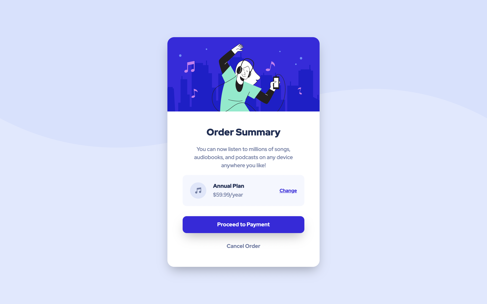

# Frontend Mentor - Order summary card solution

This is a solution to the [Order summary card challenge on Frontend Mentor](https://www.frontendmentor.io/challenges/order-summary-component-QlPmajDUj). Frontend Mentor challenges help you improve your coding skills by building realistic projects. 

## Table of contents

- [Overview](#overview)
  - [The challenge](#the-challenge)
  - [Screenshot](#screenshot)
  - [Links](#links)
- [My process](#my-process)
  - [Built with](#built-with)
- [Author](#author)

## Overview

### The challenge

Users should be able to:

- See hover states for interactive elements

### Screenshot

### Links

- Solution URL: [Click here](https://www.frontendmentor.io/solutions/order-summary-component-using-html-scss-and-bem-shM3NiQ3S)
- Live Site URL: [Click here](https://kostas1107.github.io/order-summary-component/)

## My process

### Built with

- Semantic HTML5 markup
- SCSS custom properties
- BEM methodology
- Flexbox
- Desktop-first workflow

## Author

- LinkedIn - [Let's Connect](https://www.linkedin.com/in/kostas-sudzius/)
- Frontend Mentor - [@kostas1107](https://www.frontendmentor.io/profile/kostas1107)

